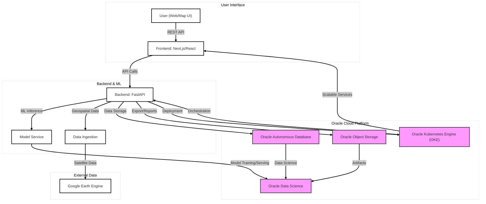
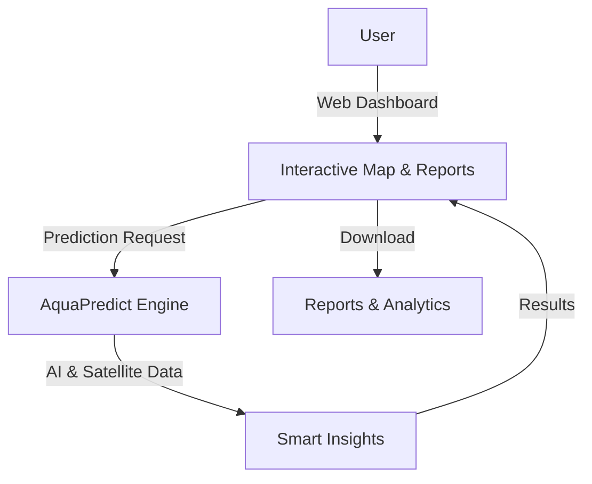

# AquaPredict – Geospatial AI for Water Security

> “A drilling team once bored deep and found only dry stone; their contract read ‘not liable for acts of God.’ But that’s not fate – that’s missing data. **AquaPredict** delivers the insights you need, so you never have to blame God for a failed well again. With AquaPredict, you turn uncertainty into opportunity.”

## 1. The Problem
- Water scarcity and unreliable groundwater data threaten sustainable development, especially in Kenya and similar regions.
- Decision-makers lack actionable, spatially-detailed insights for aquifer presence, recharge rates, and water sustainability reporting.
- Existing solutions are fragmented, not scalable, and lack integration with modern cloud and AI tools.

## 2. Why It Matters
- Impacts communities, agriculture, and national water security.
- Inhibits effective planning, investment, and sustainable management.

## 3. Our Solution
- **AquaPredict**: An enterprise-grade geospatial AI platform for aquifer prediction, groundwater recharge forecasting, and ISO 14046-compliant water sustainability reporting.
- Combines satellite data, machine learning, and cloud-native infrastructure for real-time, actionable insights.
- Built for scalability, extensibility, and ease of use for both technical and non-technical users.

## 4. Key Features
- Aquifer presence prediction (with confidence scores)
- Groundwater recharge forecasting (multi-year, decadal, and scenario-based projections)
- ISO 14046 water footprint reporting
- Real-time, interactive dashboard (map-based)
- Spatial analytics (region, distance, bounding box)
- Data export (CSV, JSON, GeoJSON, PDF)
- Market value estimation for water resources and investment planning
- Scenario modeling for climate, policy, and investment decisions

## 5. Technical Architecture
- **Frontend**: Next.js/React (modules/frontend) – interactive dashboard, analytics, reporting
- **Backend**: FastAPI (modules/backend) – REST API, ML inference, data integration
- **Data Ingestion**: Google Earth Engine, CHIRPS, ERA5, SRTM (modules/data-ingestion)
- **Preprocessing & Feature Engineering**: Data cleaning, normalization, feature extraction (modules/preprocessing, modules/feature-engineering)
- **Modeling**: ML models (Random Forest, XGBoost, LSTM, scenario-based forecasting) (modules/modeling)
- **Reporting**: Automated report generation (modules/reporting)
- **Infrastructure**: Oracle Cloud (infrastructure/), Docker, Kubernetes, Terraform

## 6. Oracle Cloud Advantage
- **Oracle Cloud Infrastructure (OCI)**: Secure, scalable compute, storage, and managed database services.
- **Oracle Autonomous Database**: Automated, secure, and high-performance data storage and analytics.
- **Oracle Kubernetes Engine (OKE)**: Scalable, containerized deployment for backend and frontend.
- **Oracle Object Storage**: Reliable storage for geospatial data and model artifacts.
- **Oracle Data Science**: Collaborative model training and deployment.
- **Power**: Enterprise reliability, global reach, security, and seamless integration with AI/ML workflows.

## 7. Other Tools
- **Google Earth Engine**: Satellite data ingestion and geospatial analysis.
- **Python (FastAPI)**: Backend APIs and ML inference.
- **React/Next.js**: Modern, interactive frontend.
- **Terraform**: Infrastructure-as-code for reproducible deployments.
- **Docker**: Containerization for portability and scalability.

## 8. User Experience
- **Frontend modules**: Interactive map, analytics, reporting, settings, history (modules/frontend)
- **Backend modules/services**: REST API, ML inference, data integration, export (modules/backend)
- **Infrastructure**: Automated deployment, scaling, and monitoring (infrastructure/)

## 9. Vision & Impact
- **Scalability:** Expandable to new regions, countries, and continents, supporting agriculture, urban planning, disaster response, and more.
- **Extensibility:** Integrate new data sources, advanced models, and evolving reporting standards.
- **Market Value:**
    - Enables water resource valuation for investment and trading.
    - Supports risk assessment for insurers and financiers.
    - Informs infrastructure planning and public-private partnerships.
- **Decision-Maker Value:**
    - Multi-decade predictions for sustainable water management.
    - Scenario analysis for policy, climate, and investment decisions.
    - Real-time alerts and reporting for operational agility.
- **Investor Value:**
    - Quantifies water asset value and investment ROI.
    - Identifies high-potential drilling and recharge zones.
    - Reduces risk of failed wells and stranded assets.
- **Climate & Environmental Impact:**
    - Supports climate adaptation and resilience planning.
    - Enables monitoring of aquifer health and recharge trends.
    - Facilitates compliance with global sustainability standards.
- **Empowerment:**
    - Equips both technical and non-technical users with actionable, predictive water insights.
    - Reduces reliance on guesswork and "acts of God" in water resource management.

---

## 10. Diagrams

### Technical Workflow (for technical users)

### Non-Technical Workflow (for non-technical users)

---

*This document is a high-level pitch and technical overview for AquaPredict, referencing all major modules and infrastructure. For more details, see the respective module READMEs and deployment guides.*
